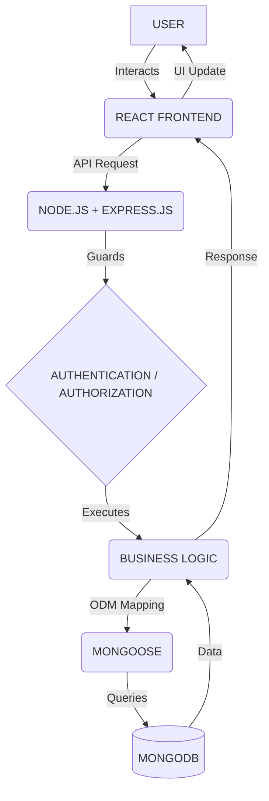

<div align="center">
  
  
  <br>

  <a href="https://linkedin.com/in/kasim-shah-176175340" target="_blank">
    
  </a>
</div>

<p align="center">
  <b>Building scalable, secure and user-focused web applications with the MERN stack.</b>
</p>

<div align="center">
  <a href="https://linkedin.com/in/kasim-shah-176175340"></a>
  <a href="https://linkedin.com/in/kasim-shah-176175340"></a>
  <a href="mailto:kasimshah998@gmail.com"></a>
  <a href="https://github.com/kasimshah19"></a>
</div>

<br>

> *"I don't just build webpages. I understand how complete software systems are planned, architected, developed, secured, integrated, and improved."*

---

## 👨‍💻 About Me

I am a final-year B.Tech Computer Engineering student and a **Backend-focused MERN Stack Developer** interested in building complete, production-oriented web applications.

My strength is understanding the holistic lifecycle of a web application from the ground up:
`User Interface` ➔ `Frontend` ➔ `API Layer` ➔ `Business Logic` ➔ `Authentication & Authorization` ➔ `Database` ➔ `Services` ➔ `Deployment`

I don't just focus on writing UI code. I deeply enjoy understanding:
- How the system should be structurally mapped and scalable
- How REST APIs should seamlessly communicate
- How database relationships and schemas should be designed
- How robust authentication and role-based authorization should work
- How real-world requirements are elegantly converted into secure technical solutions

> *"My primary stack is MERN, with a growing focus on backend engineering, system architecture, APIs, databases, authentication, authorization, and real-world problem solving."*

---

## 🧠 Engineering Mindset

| Area | My Approach |
| :--- | :--- |
| **Problem Solving** | Understand the real-world problem before writing code |
| **Architecture** | Design modules, APIs, database flow and responsibilities |
| **Backend** | Build structured APIs and core business logic |
| **Database** | Design appropriate schemas and relationships |
| **Security** | Think about authentication, authorization and validation |
| **Frontend** | Build responsive and user-friendly interfaces |
| **Scalability** | Prefer modular and maintainable architecture |
| **Collaboration** | Use Git/GitHub and structured workflows |
| **Debugging** | Identify root causes instead of applying temporary fixes |
| **Product Thinking** | Understand what the user/business actually needs |

---

## 🛠️ Tech Stack

### Frontend


### Backend *(Strong Interest)*


### Database


*I understand schema design, data modeling, CRUD, references/relationships, querying, and validation within database-driven architectures.*

### Programming Languages


-3776AB?style=for-the-badge&logo=python&logoColor=white)

### Tools & Platforms


---

## 🏗️ Full-Stack Architecture

I understand how a modern MERN application is structured and scaled end-to-end.



### 1. Frontend Layer
Responsible for state management, component architecture, routing, dynamic forms, API integration, and responsive cross-device design.

### 2. Backend Layer
Responsible for API route handling, controllers, business services, middleware filtering, authentication, validation chains, and error handling.

### 3. Database Layer
Responsible for secure data persistence, index optimization, complex relationships, schema design, and seamless querying.

---

## ⚙️ Backend Development

Backend engineering is my core interest. I actively enjoy building the brain and security constraints of applications.

- **API Design:** Building RESTful APIs, separating concerns into Routes ➔ Controllers ➔ Services, intercepting through Middleware, rigorous Request/Response validation, and clean HTTP status code delivery.
- **Authentication:** Managing registration flows, secure password hashing (bcrypt), JSON Web Tokens (JWT) lifecycle management, and protected express-router middleware endpoints.
- **Authorization:** Granular Role-Based Access Control (RBAC), resource-level ownership validation (User vs Admin), and secure backend boundaries.
- **Security Mindset:** I focus on understanding and applying backend security principles appropriate to the project, such as input sanitization, rate limiting, mass assignment prevention, XSS/NoSQL injection awareness, and secure cookie/token storage.

---

## 🗄️ Database & Data Modeling

Translating complex application requirements seamlessly into optimal database architectures:

`Requirement` ➔ `Entity Identification` ➔ `Schema Design` ➔ `Relationships` ➔ `Validation` ➔ `CRUD Operations` ➔ `Queries` ➔ `API Integration`.

*Comfortable making decisions between NoSQL (MongoDB, Firebase) vs Relational SQL architectures depending on the business logic required.*

---

## 🌍 Real-World Problem Solving

When building a project, I don't start by blindly writing code. My systematic approach:

1. Understand the problem
2. Identify users
3. Identify user roles
4. Define requirements
5. Identify modules
6. Design application architecture
7. Design database models
8. Define APIs
9. Implement authentication
10. Implement authorization
11. Build frontend
12. Integrate frontend with backend
13. Validate data
14. Test edge cases
15. Improve security
16. Optimize and refactor
17. Deploy and maintain

---

## 🧩 System Design & Architecture Thinking

I consistently evaluate systems based on Security boundaries, Scale, Maintenance, and Data Flow:

```text
User ➔ Authentication ➔ Role Verification ➔ API Gateway ➔ Controller ➔ Service ➔ Database ➔ Encoded Response ➔ UI Update
```

Every step acts as a distinct technical responsibility, ensuring the application remains debuggable and rock-solid over time.

---

## 🚀 How I Build a Full-Stack Project

<div align="left">
  <code>01 — Requirement Analysis</code><br>
  <code>02 — System Architecture</code><br>
  <code>03 — Database Design</code><br>
  <code>04 — API Design</code><br>
  <code>05 — Authentication & Authorization</code><br>
  <code>06 — Backend Development</code><br>
  <code>07 — Frontend Development</code><br>
  <code>08 — API Integration</code><br>
  <code>09 — Testing & Debugging</code><br>
  <code>10 — Security Review</code><br>
  <code>11 — Deployment</code><br>
  <code>12 — Maintenance & Improvements</code>
</div>

---

## 📌 Featured Projects

### 🚀 PROJECT_NAME

> PROJECT_DESCRIPTION

**Type:** Full Stack

**Tech Stack:** 
React • Node.js • Express.js • MongoDB • Tailwind CSS

**Core Features:**
- Feature 1
- Feature 2
- Feature 3
- Feature 4

**Architecture:**
`Frontend` ➔ `REST API` ➔ `Backend Services` ➔ `NoSQL Database`

**My Contribution:** 
MY_ROLE and individual design/development tasks completed.

**Engineering Focus:** 
Authentication / RBAC / API Design / UI

**Links:** 
[GitHub](PROJECT_GITHUB_URL) | [Live Demo](PROJECT_LIVE_URL)

---

## 🎓 Education

### Bachelor of Technology — Computer Engineering
**Ahinsa Institute Of Technology, Dondaicha**  
*Affiliated to:* **Dr. Babasaheb Ambedkar Technological University (DBATU), Maharashtra**  
*Status:* **Final Year**

### Diploma in Computer Technology
**Ahinsa Institute Of Technology, Dondaicha**  
*Duration:* **2 Years after 12th**  
*Affiliated to:* **Maharashtra State Board of Technical Education (MSBTE)**

---

## 💼 Why Hire Me?

- **Strong MERN Stack Foundation** with deep full-stack application understanding.
- **Backend Architecture Passion:** Clear focus on APIs, Logic, and Secure systems.
- **Systematic & Modular Thinker:** Real-world problem-solving approach.
- **Database Modeler:** Structured knowledge of NoSQL schema design.
- **End-to-End Delivery:** Ability to understand complete project workflows from planning to UI integration.
- **Continuous Learner:** Highly adaptable project-oriented engineering mindset.
- **Final-year Candidate** actively seeking opportunities and ready for industry exposure.

---

## 🔭 Currently Focusing On

- Advanced MERN Stack Development
- Backend Engineering & REST API Architecture
- Database Design & RBAC Strategies
- Secure Backend Development & Interview DSA Preparation
- Building sophisticated Real-World Software Systems

---

## 📚 Currently Learning / Improving

`MERN` ➔ `Advanced Backend` ➔ `System Design` ➔ `Database Optimization` ➔ `Cloud & Deployment` ➔ `Software Engineering Practices`

---

## 📊 GitHub Analytics

<div align="center">
  
  
</div>

<br>

<div align="center">
  
</div>

---

## 🐍 Contribution Activity
<!-- Placeholder for GitHub Snake. Since setting up GitHub actions is required to generate the image, this is left commented out so the README remains clean until actions are configured.
<picture>
  <source media="(prefers-color-scheme: dark)" srcset="https://raw.githubusercontent.com/kasimshah19/kasimshah19/output/github-contribution-grid-snake-dark.svg">
  <source media="(prefers-color-scheme: light)" srcset="https://raw.githubusercontent.com/kasimshah19/kasimshah19/output/github-contribution-grid-snake.svg">
  
</picture> 
-->
*(Active daily across private and public repositories building the MERN stack)*

---

## 🤝 Professional Strengths

- Problem Solving
- Logical Thinking
- System Thinking
- Communication
- Team Collaboration
- Fast Learning
- Debugging
- Requirement Understanding
- Technical Documentation
- Continuous Improvement

---

## 🎯 Career Objective

I am looking for an opportunity where I can contribute as a MERN Stack / Full Stack Developer, strengthen my backend engineering skills, work on real-world software systems, collaborate with experienced engineers, and grow into a strong software engineer.

---

## 💼 Open to Opportunities

**Have an interesting opportunity or project? Let's connect.**

Actively seeking roles in:
- MERN Stack Developer
- Full Stack Developer
- Backend Developer
- Software Engineer
- Web Developer
- JavaScript Developer

**Email:** [kasimshah998@gmail.com](mailto:kasimshah998@gmail.com)  
**LinkedIn:** [linkedin.com/in/kasim-shah-176175340](https://linkedin.com/in/kasim-shah-176175340)

---

## 📬 Let's Connect

<div align="center">
  <a href="mailto:kasimshah998@gmail.com">
    
  </a>
  <a href="https://linkedin.com/in/kasim-shah-176175340">
    
  </a>
  <a href="https://github.com/kasimshah19">
    
  </a>
</div>

<br>

<div align="center">
  <h3>Thanks for visiting my profile! 🚀</h3>
  
  <p><code>Building • Learning • Solving • Improving</code></p>
</div>
