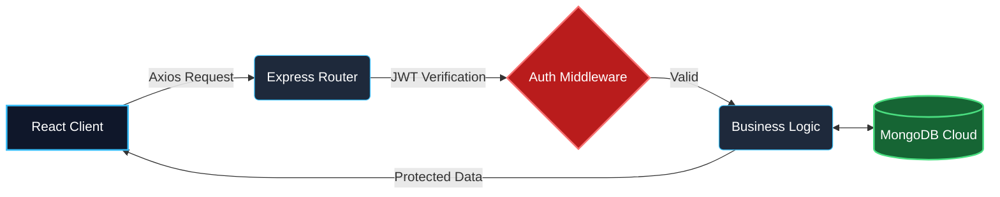

  

   

  

  

---

## 👨‍💻 About Me

Hello! I am a final year **B.Tech student** actively seeking placement and internship opportunities as a **Software Engineer / MERN Stack Developer**. While I am comfortable building clean user interfaces, my primary passion lies in **backend engineering**—designing scalable APIs, modeling databases, and structuring authentication flows.

*   🎓 **Status:** Final Year B.Tech Computer Engineering student
*   💡 **Superpower:** I understand end-to-end system architecture—how frontend, backend, database, and deployment pieces connect securely.
*   🚀 **Goal:** Eager to translate complex real-world requirements into clean, production-ready software systems across the full stack.

  🔭 <strong>Currently working on:</strong> Production-grade MERN Stack Applications 
  🌱 <strong>Currently learning:</strong> Advanced Backend Architecture & System Design 
  💡 <strong>Interested in:</strong> Logic, Databases, and API Integrations ⚙️ 
  📫 <strong>Reach me at:</strong> <a href="mailto:kasimshah998@gmail.com">kasimshah998@gmail.com</a>

---

## 🎓 Education

| Qualification | Institute | Affiliation | Duration/Status |
| :--- | :--- | :--- | :--- |
| **B.Tech (Computer Engineering)** | Ahinsa Institute of Technology, Dondaicha | Dr. Babasaheb Ambedkar Technological University (BATU) | Final Year, Placement Seeking |
| **Diploma in Computer Technology** | Ahinsa Institute of Technology, Dondaicha | Maharashtra State Board of Technical Education (MSBTE) | 2 Years (After 12th) |

---

## 🛠️ Tech Stack & Skills

### 🎨 Frontend
      

### ⚙️ Backend (Primary Interest)
    

### 🗄️ Databases
   

### 🔧 Tools & Platforms
      

### 💻 Languages & Other Concepts
    

---

## 🏗️ System Architecture & Problem Solving

I am highly capable of independently designing and executing full-stack system architecture from scratch. I don't just follow tutorials; I identify real-world business requirements, map out entity relationships, construct secure database schemas, structure RESTful routing, and design seamless deployment pipelines.

---

## 📌 Featured Projects

| Project Name | Tech Stack | Description | Live Demo | GitHub Repo |
| :--- | :--- | :--- | :--- | :--- |
| **Project 1 Placeholder** | React, Node.js, Express, MongoDB | Describes the real-world problem solved and the frontend-to-backend flow. | [Live Demo 🚀](#) | [GitHub Source 💻](#) |
| **Project 2 Placeholder** | React, Firebase, Tailwind CSS | Describes the structural logic and custom hooks applied in the UI. | [Live Demo 🚀](#) | [GitHub Source 💻](#) |
| **Project 3 Placeholder** | HTML, CSS, JavaScript, API | Describes how third-party APIs were integrated seamlessly. | [Live Demo 🚀](#) | [GitHub Source 💻](#) |

---

## 📊 GitHub Analytics

  
  

 

  

 

  

 

  <!-- GitHub Snake Animation Placeholder -->
  <!-- Note: Requires GitHub Actions to generate the dynamic SVG in your repo -->
  <picture>
    <source media="(prefers-color-scheme: dark)" srcset="https://raw.githubusercontent.com/kasimshah19/kasimshah19/output/github-contribution-grid-snake-dark.svg">
    <source media="(prefers-color-scheme: light)" srcset="https://raw.githubusercontent.com/kasimshah19/kasimshah19/output/github-contribution-grid-snake.svg">
    
  </picture>

---

## 📬 Let's Connect

  
  
  

 

  <h3>Thanks for visiting my profile &mdash; Let's build something great together! 🚀</h3>
  

