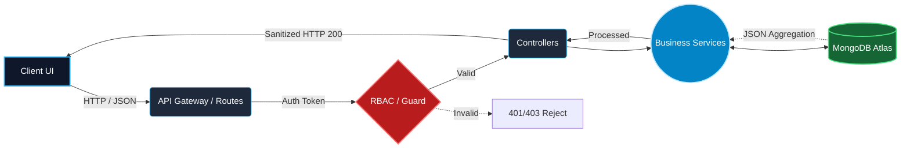

<!-- FULL WIDTH HEADER ANIMATION -->

   
  

  <i>"I don't just write code; I architect end-to-end systems that solve business problems safely, effectively, and at scale."</i>

  
  
  

 

---

## 👨‍💻 Executive Summary

I am a **Software Engineer** and **Full-Stack (MERN) Developer** currently in my final year of B.Tech. While I build sleek UIs using React and Tailwind, my absolute obsession lies **under the hood**: engineering secure backends, designing relational/non-relational schemas, establishing Role-Based Access Control (RBAC), and connecting systems seamlessly.

I approach software as a structural puzzle. Before writing a single line of code, you will find me drawing entity-relationship diagrams and mapping API request payloads. 

> **Goal:** Joining an ambitious engineering team to contribute clean, maintainable backend logic, fluid user interfaces, and scalable production code.

---

## 🏗️ System Architecture Philosophy

I visualize and build software using an isolated, tier-driven architecture preventing tight coupling. Here is how I process data through the stack:

<b>🔍 Tap to expand: Backend Security & API Pipeline</b>

 

- **JWT Authentication:** Strict token rotation and validation boundaries protecting core system data.
- **Middleware Firewalls:** Rate-limiting, IP-binding, and Request Body Validation (express-validator) before hitting controllers.
- **Aggregation Pipelines:** Leveraging native DB logic to process intense calculations server-side, reducing frontend payload blocking.
- **Modular Services:** Keeping routing completely separated from business logic, making unit testing incredibly clean.

---

## 🛠️ The Tech Arsenal

   
  
  ### ⚙️ Backend & Systems (Core Focus)
  
  
    

  ### 🎨 Frontend & Design
  

    

  ### 💼 Languages, Version Control & Operations
  
  

---

## 🌍 The Real-World Engineering Process

Great code is the byproduct of great planning. This is how I deliver features from requirements to production:

<b>👉 Step-by-Step Implementation Framework</b>

 

1. **System Blueprinting:** Identify user-roles, resources, and map out the domain logic.
2. **Schema Modeling:** Define rigid Mongoose Schemas, ensuring references and index optimization.
3. **API Definition:** Structure secure REST endpoints (`GET`, `POST`, `PUT`, `DELETE`, `PATCH`).
4. **Auth Layer Injection:** Bolt on JWT guards and Role-Based restrictions.
5. **Business Logic Code:** Develop isolated services, avoiding "fat controllers".
6. **Frontend Wiring:** Integrate Redux state management and Axios interceptors to marry the UI to the API.
7. **Stress & Error Testing:** Checking edge-cases (null payloads, unauthorized attempts, heavy traffic).
8. **Deployment Matrix:** Pushing finalized images to the cloud for real-world usage.

---

## 🎓 Academic Credentials

`🎓 Bachelor of Technology — Computer Engineering (Final Year)`  
**Ahinsa Institute Of Technology** | *Dr. Babasaheb Ambedkar Technological University (DBATU)*

`📄 Diploma in Computer Technology (2-Year Fast-track)`  
**Ahinsa Institute Of Technology** | *Maharashtra State Board of Technical Education (MSBTE)*

---

## 📈 Engineering Analytics (Live)

I write code daily. Continuous improvement is written into my schedule.

  
  
  
   
  
  

---

## 💼 Why Kasim? (For Hiring Managers)

If you need a developer who just writes HTML/CSS and stops thinking there, I am not your guy. 

If your team needs a **Software Engineer** who questions API structures, designs fault-tolerant databases, understands the heavy mechanics of state-management and authentication logic, and takes true ownership of full-stack features from whiteboard to deployment — **we should talk.**

 

  

