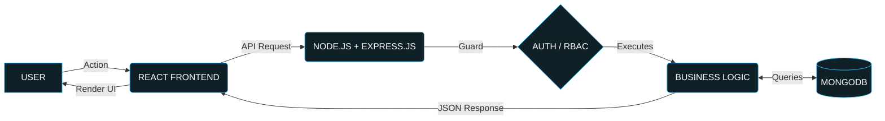

<!-- HERO SECTION: 6-SECOND RULE COMPLIANT -->

  
   

  

  <b>Building scalable, secure and user-focused web applications with the MERN stack.</b>

  
  
  
  
  <!--  -->
  <!--  -->

---

<b>📚 Table of Contents</b> <i>(Click to expand)</i>

1. [About Me](#-about-me)
2. [Engineering Mindset](#-engineering-mindset)
3. [Tech Stack](#️-tech-stack)
4. [Full-Stack Architecture](#-full-stack-architecture)
5. [Backend Development](#️-backend-development)
6. [Database & Data Modeling](#-database--data-modeling)
7. [Real-World Problem Solving](#-real-world-problem-solving)
8. [System Design Thinking](#-system-design--architecture-thinking)
9. [How I Build Projects](#-how-i-build-a-full-stack-project)
10. [Featured Projects](#-featured-projects)
11. [Education](#-education)
12. [Certifications & Coding Profiles](#-certifications--achievements)
13. [GitHub Analytics](#-github-analytics)
14. [Contact](#-lets-connect)

---

## 👨‍💻 About Me

Hello! I am a final-year B.Tech Computer Engineering student and an industry-oriented **MERN Stack Developer**. My core objective is building complete, production-ready web applications with a robust focus on backend engineering.

My strength is understanding the complete structural lifecycle of software:
`User Interface` ➔ `Frontend` ➔ `API Layer` ➔ `Business Logic` ➔ `Auth` ➔ `Database` ➔ `Deployment`

I care deeply about:
- API Communication & Database Design
- Authentication & Authorization Flows
- Frontend-Backend Communication
- Converting real-world requirements into technical solutions

---

## 🧠 Engineering Mindset

| Area | My Approach |
| :--- | :--- |
| **Problem Solving** | Understand the real-world problem before writing code |
| **Architecture** | Design modules, APIs, database flow and responsibilities |
| **Backend** | Build structured APIs and core business logic |
| **Database** | Design appropriate schemas and relationships |
| **Security** | Think about authentication, authorization and validation |
| **Frontend** | Build responsive and user-friendly interfaces |
| **Scalability** | Prefer modular and maintainable architecture |
| **Collaboration** | Use Git/GitHub and structured workflows |
| **Debugging** | Identify root causes instead of applying temporary fixes |
| **Product Thinking** | Understand what the user/business actually needs |

---

## 🛠️ Tech Stack

### Frontend
     

### Backend *(Strong Interest)*
    

### Database
   

### Languages & Tools
     

---

## 🏗️ Full-Stack Architecture

I understand how to independently architect full-stack environments.

**[ASCII Fallback]**
`USER ➔ REACT FRONTEND ➔ NODE.JS/EXPRESS ➔ AUTH/RBAC ➔ BUSINESS LOGIC ➔ DATABASE ➔ RESPONSE ➔ UI`

*   **Frontend Layer:** UI, state management, routing, API integration, responsive design.
*   **Backend Layer:** Routes, controllers, services, middleware, validation, error handling.
*   **Database Layer:** Data persistence, schema design, queries, aggregation.

---

## ⚙️ Backend Development

*   **API Design:** RESTful APIs, modular route organization, controllers, middleware, and request/response validation.
*   **Authentication:** Real-world implementations of registration, login, bcrypt password hashing, JWT lifecycle, and protected middleware routes.
*   **Authorization:** Role-based permissions (RBAC) supporting granular admin/user capabilities.
*   **Backend Security Mindset:** I focus on understanding and applying backend security principles appropriate to the project (validation, NoSQL injection awareness, IDOR prevention, mass assignment, rate limiting).

---

## 🗄️ Database & Data Modeling

Translating business requirements into structured persistence logic.

`Requirement` ➔ `Entity Identification` ➔ `Schema Design` ➔ `Relationships` ➔ `Validation` ➔ `CRUD` ➔ `API Integration`

---

## 🌍 Real-World Problem Solving

1. Understand the problem ➔ 2. Identify users ➔ 3. Identify user roles ➔ 4. Define requirements ➔ 5. Identify modules ➔ 6. Design application architecture ➔ 7. Design database models ➔ 8. Define APIs ➔ 9. Implement authentication ➔ 10. Implement authorization ➔ 11. Build frontend ➔ 12. Integrate frontend with backend ➔ 13. Validate data ➔ 14. Test edge cases ➔ 15. Improve security ➔ 16. Optimize and refactor ➔ 17. Deploy and maintain

---

## 🧩 System Design & Architecture Thinking

I trace features through their entire structural flow before implementation.

`User` ➔ `Authentication` ➔ `Role Verification` ➔ `API` ➔ `Controller` ➔ `Service` ➔ `Database` ➔ `Response` ➔ `UI Update`

---

## 🚀 How I Build a Full-Stack Project

`01 Requirement Analysis` • `02 System Architecture` • `03 Database Design` • `04 API Design` • `05 Authentication & Authorization` • `06 Backend Development` • `07 Frontend Development` • `08 API Integration` • `09 Testing & Debugging` • `10 Security Review` • `11 Deployment` • `12 Maintenance & Improvements`

---

## 📌 Featured Projects

### 🚀 PROJECT_NAME
> PROJECT_DESCRIPTION
**Type:** Full Stack / Web Application
**Tech Stack:** React • Node.js • Express.js • MongoDB • Tailwind
**Core Features:** 
- Feature 1
- Feature 2
- Feature 3
**Architecture:** Frontend ➔ API ➔ Express.js Server [Routes/Controllers/Services] ➔ Database
**My Contribution:** MY_ROLE
**Engineering Focus:** API Design / Authentication / Database Modeling
**Links:** [GitHub](PROJECT_GITHUB_URL) | [Live Demo](PROJECT_LIVE_URL)

---

## 🎓 Education

| Degree / Certificate | Institute | Affiliated Body | Status |
| :--- | :--- | :--- | :--- |
| **Bachelor of Technology — Computer Engineering** | Ahinsa Institute Of Technology, Dondaicha | Dr. Babasaheb Ambedkar Technological University (DBATU), Maharashtra | Final Year |
| **Diploma in Computer Technology** | Ahinsa Institute Of Technology, Dondaicha | Maharashtra State Board of Technical Education (MSBTE) | 2 Years |

---

## 📜 Certifications & Achievements

- `CERTIFICATION_NAME` — `ISSUING_PLATFORM` — `YEAR`
- `HACKATHON_NAME` — `ORGANIZATION` — `YEAR`

## 💻 Coding Profiles

 
 

---

## 💼 Why Hire Me?

- Strong MERN foundation with holistic full-stack understanding.
- Backend development interest & API design competence.
- Systems architecture and real-world problem-solving approach.
- Security-aware mindset & database design tracking.
- Willingness to learn, adapt, and write production-grade code.
- Final-year engineering candidate actively seeking full-time opportunities.

---

## 🔭 Currently Focusing On

Advanced MERN Stack Development, Backend Engineering, REST API Architecture, Database Design, Authentication & Authorization, RBAC, System Architecture, Software Engineering Best Practices, Interview & DSA Preparation.

## 📚 Currently Learning / Improving

`MERN` ➔ `Advanced Backend` ➔ `System Design` ➔ `Database Optimization` ➔ `Cloud & Deployment` 

---

## 📊 GitHub Analytics

  
  
  
   

  

  

---

## 🐍 Contribution Activity
<!-- GitHub Action generates this snake animation SVG. Ensure workflows are running properly to generate this file in the output branch. -->
<picture>
  <source media="(prefers-color-scheme: dark)" srcset="https://raw.githubusercontent.com/kasimshah19/kasimshah19/output/github-contribution-grid-snake-dark.svg">
  <source media="(prefers-color-scheme: light)" srcset="https://raw.githubusercontent.com/kasimshah19/kasimshah19/output/github-contribution-grid-snake.svg">
  
</picture>

---

## 🤝 Professional Strengths
`Problem Solving` • `Logical Thinking` • `System Thinking` • `Communication` • `Debugging` • `Continuous Improvement` • `Requirement Understanding`

---

## 🎯 Career Objective

I am looking for an opportunity where I can contribute as a MERN Stack / Full Stack Developer, strengthen my backend engineering skills, work on real-world software systems, collaborate with experienced engineers, and grow into a strong software engineer.

## 💼 Open to Opportunities

**Have an interesting opportunity or project? Let's connect.**
Actively looking for: *MERN Stack Developer, Full Stack Developer, Backend Developer, Software Engineer*.

---

## 📬 Let's Connect

  
  
  

 

  
  
<b>Thanks for visiting my profile! 🚀</b>

  <code>Building • Learning • Solving • Improving</code>
  
<i>⭐ If you found my profile interesting, feel free to check out my repositories.</i>

